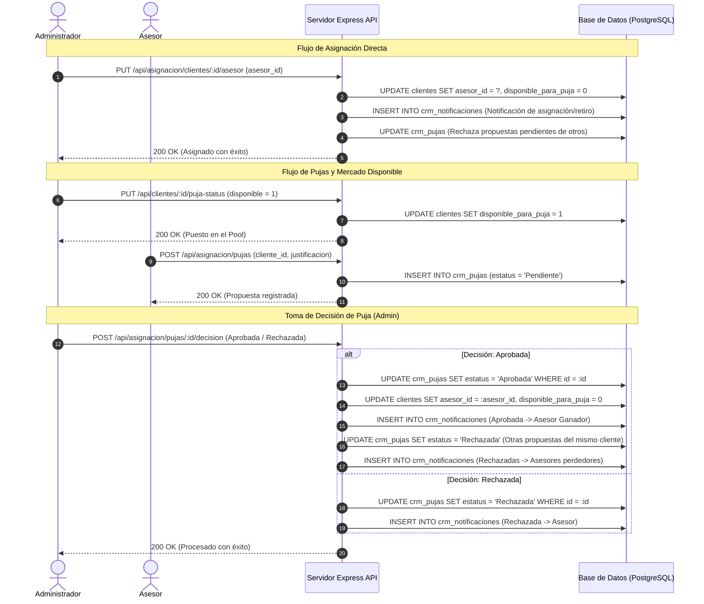
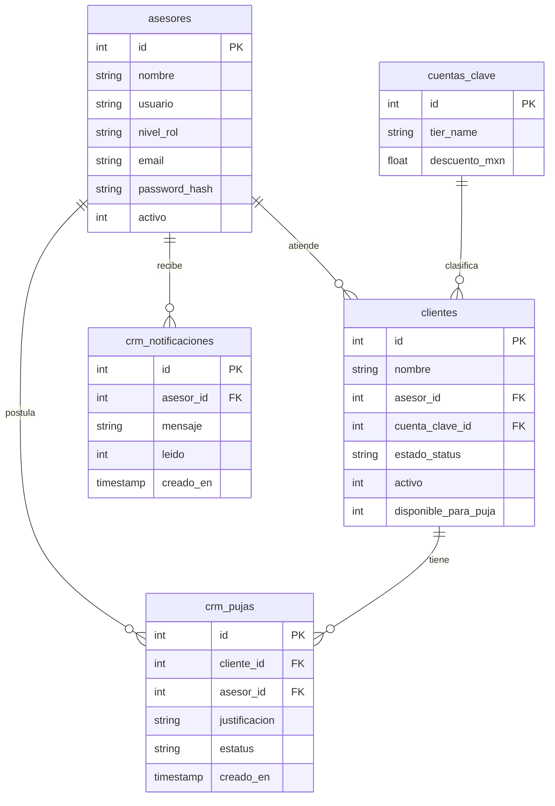

# AgriSales Pro - Documento de Diseño del Sistema (SDD)

Este documento detalla la arquitectura técnica, el modelo de datos, la lógica del motor de coincidencia inteligente (AI Matching Engine) y las especificaciones de la API para el módulo de asignación inteligente y subasta (pujas) de agricultores sin asesor en **AgriSales Pro**.

---

## 1. Arquitectura General y Flujo de Trabajo

El módulo opera como un sistema distribuido entre el cliente web (frontend SPA) y el servidor Express.js (backend) respaldado por PostgreSQL.

### Diagrama de Flujo de Trabajo (Mermaid)



---

## 2. Modelo de Datos (Esquema de Base de Datos)

El sistema utiliza tablas relacionales con llaves foráneas e integridad referencial (`ON DELETE CASCADE`) para soportar las entidades y notificaciones del CRM.

### Diagrama de Relación de Entidades (ERD)



### Definición SQL de Tablas Clave (PostgreSQL DDL)

```sql
-- Extensión de Clientes para el Pool de Pujas
ALTER TABLE clientes ADD COLUMN IF NOT EXISTS disponible_para_puja INTEGER DEFAULT 0;

-- Tabla de Propuestas de Asesores (Pujas)
CREATE TABLE IF NOT EXISTS crm_pujas (
    id SERIAL PRIMARY KEY,
    cliente_id INTEGER NOT NULL,
    asesor_id INTEGER NOT NULL,
    justificacion TEXT,
    estatus TEXT DEFAULT 'Pendiente', -- 'Pendiente', 'Aprobada', 'Rechazada'
    creado_en TIMESTAMP DEFAULT CURRENT_TIMESTAMP,
    FOREIGN KEY (cliente_id) REFERENCES clientes(id) ON DELETE CASCADE,
    FOREIGN KEY (asesor_id) REFERENCES asesores(id) ON DELETE CASCADE
);

-- Tabla de Bandeja de Alertas (Notificaciones)
CREATE TABLE IF NOT EXISTS crm_notificaciones (
    id SERIAL PRIMARY KEY,
    asesor_id INTEGER NOT NULL,
    mensaje TEXT NOT NULL,
    leido INTEGER DEFAULT 0, -- 0 = No leído, 1 = Leído
    creado_en TIMESTAMP DEFAULT CURRENT_TIMESTAMP,
    FOREIGN KEY (asesor_id) REFERENCES asesores(id) ON DELETE CASCADE
);
```

---

## 3. Motor de Recomendación IA (AI Matching Engine)

Para evitar sugerencias idénticas u obsoletas, el frontend procesa heurísticas basadas en datos dinámicos obtenidos en tiempo real de la base de datos (`GET /api/asignacion/metricas-AI`).

### 3.1 Entrada de Datos
Para cada asesor activo $A$, el motor analiza:
* $S_A$: Ventas acumuladas de cotizaciones en estado `'Vendido'` o `'Entregado'` en MXN.
* $V_A$: Visitas programadas totales.
* $V_{c,A}$: Visitas completadas (`realizada = 1`).
* $V_{p,A}$: Visitas pendientes en la agenda (`realizada = 0`).

Para el agricultor huérfano analizado $C$, el motor extrae:
* $P_C$: Compras históricas totales en MXN.

### 3.2 Fórmulas del Algoritmo

1. **Ventas Relativas ($SalesScore_A$):**
   $$SalesScore_A = \frac{S_A}{\max_{i \in \text{Asesores}} (S_i)} \times 100$$
   *(Si el máximo es 0, se toma como 1 para evitar división por cero)*.

2. **Tasa de Cumplimiento ($ComplianceRate_A$):**
   $$ComplianceRate_A = \begin{cases} 
      \frac{V_{c,A}}{V_A} \times 100 & \text{si } V_A > 0 \\
      70 & \text{si } V_A = 0 \text{ (valor base neutral)}
   \end{cases}$$

3. **Efectividad de Disponibilidad / Carga de Trabajo ($AvailabilityScore_A$):**
   $$AvailabilityScore_A = \frac{\max_{i \in \text{Asesores}} (V_{p,i}) - V_{p,A}}{\max_{i \in \text{Asesores}} (V_{p,i})} \times 100$$
   *(Premia con mayor puntaje a quienes tienen menor agenda de visitas pendientes)*.

4. **Porcentaje de Coincidencia Final ($MatchScore_A$):**
   * **Caso A: Cliente Premium ($P_C > \$1\text{M MXN}$):**
     Se prioriza el perfil comercial experimentado y de alto volumen de ventas:
     $$MatchScore_A = \text{round}(SalesScore_A \times 0.6 + ComplianceRate_A \times 0.4)$$
   * **Caso B: Cliente Regular/Nuevo ($P_C \le \$1\text{M MXN}$):**
     Se prioriza la disponibilidad inmediata para evitar sobrecarga del asesor:
     $$MatchScore_A = \text{round}(AvailabilityScore_A \times 0.6 + ComplianceRate_A \times 0.4)$$

*Nota: La puntuación mínima de coincidencia se limita a 10% para evitar puntajes nulos.*

### 3.3 Criterios de Desempate (Tie-breakers)
En caso de que dos asesores tengan el mismo $MatchScore_A$:
* **Para Clientes Premium:** Se posiciona en primer lugar al asesor con **mayor volumen absoluto de ventas** ($S_A$).
* **Para Clientes Regulares/Nuevos:** Se posiciona en primer lugar al asesor con **menor número de visitas pendientes** ($V_{p,A}$), liberando carga operativa.

---

## 4. API Endpoints

### 4.1 Asignación Directa de Asesor
* **Ruta:** `PUT /api/asignacion/clientes/:id/asesor`
* **Rol:** Administrador
* **Cuerpo de Solicitud:**
  ```json
  { "asesor_id": 3 }
  ```
* **Acciones Internas:**
  1. Actualiza `clientes.asesor_id` y resetea `disponible_para_puja` a `0`.
  2. Inserta notificaciones a los asesores involucrados (asignado y retirado).
  3. Cambia las propuestas pendientes en `crm_pujas` a `'Aprobada'` para el asesor seleccionado, y `'Rechazada'` para el resto, disparando las respectivas notificaciones.

### 4.2 Habilitar/Deshabilitar Disponibilidad para Pujas
* **Ruta:** `PUT /api/clientes/:id/puja-status`
* **Rol:** Administrador
* **Cuerpo de Solicitud:**
  ```json
  { "disponible_para_puja": true }
  ```
* **Acciones Internas:**
  1. Habilita o deshabilita la bandera `disponible_para_puja` en la tabla `clientes`.
  2. Si se deshabilita, rechaza automáticamente las propuestas que estuviesen pendientes.

### 4.3 Consultar Propuestas/Pujas
* **Ruta:** `GET /api/asignacion/pujas`
* **Rol:** Administrador / Asesor
* **Filtro Implícito:** Si el usuario es de rol *Asesor*, el backend filtra las filas para retornar únicamente las propuestas generadas por su propio ID de asesor. Los administradores reciben todas las candidaturas.

### 4.4 Registrar Propuesta de Puja
* **Ruta:** `POST /api/asignacion/pujas`
* **Rol:** Asesor
* **Cuerpo de Solicitud:**
  ```json
  {
    "cliente_id": 4,
    "justificacion": "Tengo experiencia en cultivos de manzana en la zona alta y disponibilidad los miércoles."
  }
  ```
* **Acciones Internas:** Inserta una nueva propuesta en `crm_pujas` o actualiza la justificación si ya existía una postulación previa pendiente para ese cliente.

### 4.5 Decisión sobre Propuesta de Puja
* **Ruta:** `POST /api/asignacion/pujas/:id/decision`
* **Rol:** Administrador
* **Cuerpo de Solicitud:**
  ```json
  { "decision": "Aprobada" } -- o "Rechazada"
  ```

### 4.6 Obtener Métricas para Recomendación IA
* **Ruta:** `GET /api/asignacion/metricas-AI`
* **Rol:** Administrador / Coordinador
* **Respuesta:**
  ```json
  {
    "advisors": [
      {
        "asesor_id": 2,
        "nombre": "Carlos Mendoza",
        "total_sales_mxn": 1250000.0,
        "completed_visits": 15,
        "total_visits": 20,
        "pending_visits": 5
      }
    ],
    "clients": [
      {
        "cliente_id": 10,
        "nombre": "Rancho San Isidro",
        "total_purchase_mxn": 1500000.0
      }
    ]
  }
  ```

### 4.7 Bandeja de Notificaciones y Limpieza
* **Ruta:** `GET /api/notificaciones`
  * Retorna las últimas 20 notificaciones para el asesor autenticado.
* **Ruta:** `POST /api/notificaciones/leido`
  * Actualiza todas las notificaciones del asesor a estado `leido = 1`.

---

## 5. Diseño del Frontend e Interfaces

### 5.1 Flujo Drag & Drop en el Panel de Administrador
* El panel de asignación está implementado en HTML5 puro con los atributos `draggable="true"` en las tarjetas de agricultores sin asesor.
* Zonas de arrastre (`dropzones`):
  * **Asesores (Columna Central):** Cada tarjeta de asesor escucha los eventos `dragover` y `drop`. El evento `drop` lee el ID del agricultor y llama a `assignClientDirectly(clientId, asesorId, asesorNombre)`.
  * **Pool Pujas (Columna Derecha - `#assign-biddable-card`):** Escucha eventos de arrastre. Al soltar la tarjeta de un agricultor aquí, llama a `toggleBiddableStatus(clientId, true)` para publicarlo en la mesa de subasta de asesores.

### 5.2 Estética e Indicadores Visuales
* **Bandeja de Notificaciones (Asesor):** Cuenta flotante en la barra lateral con la cantidad de notificaciones sin leer. Diseño con fondo pastel rojizo difuminado y micro-animación CSS de pulso.
* **Decisiones del Administrador:** El modal de propuestas de puja detalla de forma clara el historial de compras del agricultor en el pool, y renderiza tarjetas individuales para cada asesor postulado, desplegando su Match Score correspondiente, su justificación en cursiva y sus estadísticas de ventas y cumplimiento de visitas.
